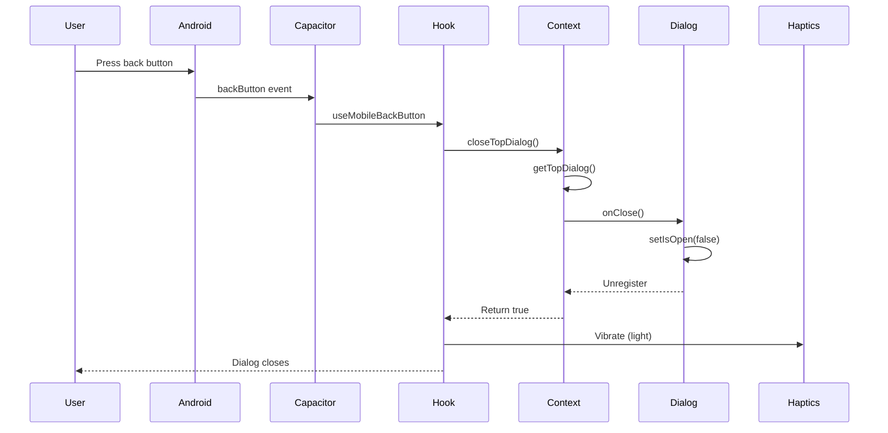
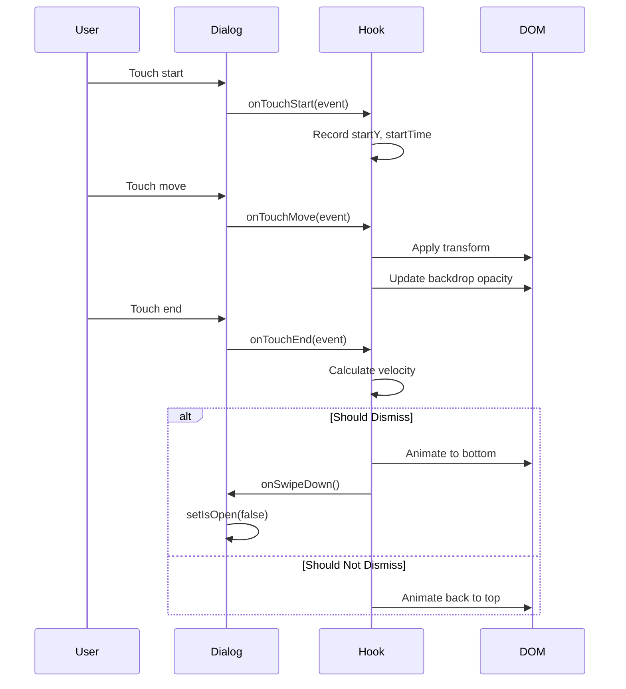

# Mobile Gesture Support - Technical Specifications

**Tanggal:** 6 November 2025  
**Version:** 1.0  
**Status:** 📋 Planning

## 📋 Table of Contents

1. [Architecture Overview](#architecture-overview)
2. [Component Specifications](#component-specifications)
3. [API Specifications](#api-specifications)
4. [Event Flow](#event-flow)
5. [Performance Requirements](#performance-requirements)
6. [Security Considerations](#security-considerations)

---

## Architecture Overview

### System Layers

```
┌───────────────────────────────────────────────────┐
│                  Presentation Layer               │
│  - React Components (Dialogs)                    │
│  - UI feedback (animations, haptics)             │
└─────────────────────┬─────────────────────────────┘
                      │
┌─────────────────────┴─────────────────────────────┐
│               Application Layer                    │
│  - DialogStackContext (state management)          │
│  - Custom Hooks (gesture detection, registration) │
└─────────────────────┬─────────────────────────────┘
                      │
┌─────────────────────┴─────────────────────────────┐
│                Platform Layer                      │
│  - Capacitor Plugins (@capacitor/app, haptics)   │
│  - Native Android APIs                            │
└───────────────────────────────────────────────────┘
```

### Data Flow

```
User Action (Back Button / Swipe)
        ↓
Capacitor Event / Touch Event
        ↓
Custom Hook (useMobileBackButton / useSwipeGesture)
        ↓
Query DialogStack Context
        ↓
Get Top Priority Dialog
        ↓
Execute Dialog's onClose callback
        ↓
Update UI State (isOpen = false)
        ↓
Trigger Animation & Haptic
        ↓
Complete
```

---

## Component Specifications

### 1. DialogStackContext

**Location:** `/contexts/DialogStackContext.tsx`

#### Interface

```typescript
interface DialogInfo {
  id: string;           // Unique identifier
  priority: number;     // Higher = closes first
  onClose: () => void;  // Callback to close dialog
}

interface DialogStackContextType {
  dialogs: DialogInfo[];
  registerDialog: (dialog: DialogInfo) => void;
  unregisterDialog: (id: string) => void;
  getTopDialog: () => DialogInfo | null;
  closeTopDialog: () => boolean;
}
```

#### State Management

```typescript
// Internal state
const [dialogs, setDialogs] = useState<DialogInfo[]>([]);

// Thread-safe registration (prevents duplicates)
const registerDialog = useCallback((dialog: DialogInfo) => {
  setDialogs(prev => {
    const exists = prev.find(d => d.id === dialog.id);
    if (exists) return prev;
    return [...prev, dialog];
  });
}, []);

// Cleanup
const unregisterDialog = useCallback((id: string) => {
  setDialogs(prev => prev.filter(d => d.id !== id));
}, []);
```

#### Priority Algorithm

```typescript
const getTopDialog = useCallback(() => {
  if (dialogs.length === 0) return null;
  
  // Sort by priority DESC (higher priority first)
  const sorted = [...dialogs].sort((a, b) => b.priority - a.priority);
  
  // Return highest priority
  return sorted[0];
}, [dialogs]);
```

**Time Complexity:** O(n log n) where n = number of open dialogs  
**Space Complexity:** O(n)

---

### 2. useMobileBackButton Hook

**Location:** `/hooks/useMobileBackButton.ts`

#### Dependencies

```typescript
import { useEffect, useRef } from 'react';
import { App } from '@capacitor/app';
import { useDialogStack } from '../contexts/DialogStackContext';
import { triggerHaptic, isCapacitor } from '../utils/capacitor-helpers';
```

#### Lifecycle

```typescript
useEffect(() => {
  // Guard: Only run in Capacitor
  if (!isCapacitor()) return;

  // Register listener
  const backButtonHandler = App.addListener('backButton', async (event) => {
    // Handle back button press
  });

  // Cleanup
  return () => {
    backButtonHandler.remove();
  };
}, [closeTopDialog]);
```

#### Back Button Logic

```typescript
// Pseudo-code
if (dialog exists) {
  close_top_dialog();
  vibrate(light);
  prevent_default();
} else {
  if (time_since_last_back < 2000ms) {
    exit_app();
  } else {
    show_toast("Press again to exit");
    vibrate(light);
    start_2_second_timer();
  }
}
```

**Performance:**
- Back button handler execution: < 100ms
- Dialog query: O(n log n)
- Haptic trigger: < 50ms

---

### 3. useDialogRegistration Hook

**Location:** `/hooks/useDialogRegistration.ts`

#### Signature

```typescript
function useDialogRegistration(
  isOpen: boolean,
  onOpenChange: (open: boolean) => void,
  priority: number = 5,
  dialogId?: string
): string
```

#### Parameters

| Parameter | Type | Default | Description |
|-----------|------|---------|-------------|
| `isOpen` | boolean | - | Current open state |
| `onOpenChange` | function | - | State setter callback |
| `priority` | number | 5 | Priority level (1-20) |
| `dialogId` | string? | auto | Unique identifier |

#### Return Value

Returns the dialog's unique ID (for reference if needed).

#### Side Effects

- Registers dialog on mount (when isOpen = true)
- Unregisters on unmount
- Triggers haptic on open (if Capacitor)

---

### 4. useSwipeGesture Hook

**Location:** `/hooks/useSwipeGesture.ts`

#### Configuration

```typescript
interface SwipeConfig {
  onSwipeDown?: () => void;        // Callback for swipe down
  onSwipeUp?: () => void;          // Callback for swipe up (optional)
  threshold?: number;              // Distance threshold (px)
  velocityThreshold?: number;      // Velocity threshold (px/ms)
  enabled?: boolean;               // Enable/disable
}
```

#### Touch Event Handling

```typescript
// Touch phases
TouchStart: Record initial position & time
TouchMove: Track movement, apply transform
TouchEnd: Determine if should dismiss

// Transform calculation
deltaY = currentY - startY
transform = translateY(deltaY)
opacity = max(0, 1 - abs(deltaY) / 300)

// Dismiss condition
shouldDismiss = (deltaY > threshold) OR (velocity > velocityThreshold)
```

#### Gesture Detection Algorithm

```typescript
// 1. Direction Detection
isVertical = abs(deltaY) > abs(deltaX)

// 2. Velocity Calculation
velocity = deltaY / deltaTime

// 3. Dismiss Decision
if (deltaY > threshold) {
  dismiss = true;
} else if (velocity > velocityThreshold) {
  dismiss = true;
} else {
  dismiss = false;
  bounce_back();
}
```

**Performance:**
- Touch event handling: < 16ms (60fps)
- Transform application: GPU-accelerated
- Animation: CSS transitions (hardware-accelerated)

---

## API Specifications

### Capacitor App Plugin

**Package:** `@capacitor/app`

#### Back Button Event

```typescript
interface BackButtonEvent {
  canGoBack: boolean;  // Whether navigation stack has history
}

App.addListener('backButton', (event: BackButtonEvent) => {
  // Handle back button
});
```

**Event Frequency:** Max 1 per 100ms (Android system throttle)  
**Thread:** UI thread (synchronous)

#### App Exit

```typescript
App.exitApp(): Promise<void>
```

Exits the application immediately.

---

### Capacitor Haptics Plugin

**Package:** `@capacitor/haptics`

#### Impact Styles

```typescript
enum ImpactStyle {
  Light,    // Subtle feedback (default)
  Medium,   // Moderate feedback
  Heavy     // Strong feedback
}

Haptics.impact({ 
  style: ImpactStyle.Light 
}): Promise<void>
```

**Vibration Duration:**
- Light: ~10ms
- Medium: ~15ms
- Heavy: ~25ms

**Performance:** < 50ms to trigger  
**Battery Impact:** Negligible for occasional use

---

## Event Flow

### Back Button Flow



**Total Time:** < 100ms from press to visual feedback

### Swipe Gesture Flow



**Frame Budget:** 16.67ms per frame (60fps)  
**Touch Latency:** < 50ms

---

## Performance Requirements

### Response Time

| Action | Target | Maximum |
|--------|--------|---------|
| Back button press → dialog close | < 50ms | < 100ms |
| Swipe gesture detection | < 16ms | < 33ms |
| Animation frame rate | 60fps | 50fps |
| Haptic feedback trigger | < 30ms | < 50ms |

### Resource Usage

| Resource | Target | Maximum |
|----------|--------|---------|
| Bundle size increase | < 5KB | < 10KB |
| Memory usage (idle) | < 100KB | < 500KB |
| Memory usage (active) | < 1MB | < 2MB |
| CPU usage (gesture) | < 10% | < 20% |

### Scalability

| Metric | Supported | Target |
|--------|-----------|--------|
| Concurrent dialogs | 10 | 5 |
| Dialog stack size | 20 | 10 |
| Touch events/sec | 100 | 60 |
| Registrations/sec | 50 | 10 |

---

## Security Considerations

### Input Validation

#### Dialog ID Validation

```typescript
// Prevent XSS through dialog IDs
const sanitizeDialogId = (id: string): string => {
  return id.replace(/[^a-zA-Z0-9-_]/g, '');
};
```

#### Touch Event Validation

```typescript
// Prevent touch injection attacks
const isTrustedTouchEvent = (e: TouchEvent): boolean => {
  return e.isTrusted === true;
};
```

### State Integrity

#### Prevent Race Conditions

```typescript
// Use functional state updates
setDialogs(prev => {
  // Atomic operation
  return [...prev, newDialog];
});
```

#### Prevent Memory Leaks

```typescript
// Always cleanup in useEffect
useEffect(() => {
  // Setup
  const handler = setupHandler();
  
  // Cleanup
  return () => {
    handler.remove();
  };
}, [deps]);
```

### Privacy

- ❌ No user data collected by gesture system
- ❌ No analytics or tracking
- ❌ No network requests
- ✅ All processing local

### Permissions

Required Android permissions:

```xml
<uses-permission android:name="android.permission.VIBRATE" />
```

Optional permissions: NONE

---

## Browser Compatibility

### Feature Detection

```typescript
// Check Capacitor availability
const isCapacitor = (): boolean => {
  return typeof window !== 'undefined' && !!window.Capacitor;
};

// Check platform
const isAndroid = (): boolean => {
  return isCapacitor() && window.Capacitor.getPlatform() === 'android';
};
```

### Graceful Degradation

```typescript
// If Capacitor not available
if (!isCapacitor()) {
  // Fall back to standard web behavior
  // - Escape key for dialogs
  // - Click outside for dismiss
  // - No haptics
}
```

### Supported Platforms

| Platform | Back Button | Swipe Gesture | Haptics |
|----------|-------------|---------------|---------|
| Android (Capacitor) | ✅ Full | ✅ Full | ✅ Full |
| iOS (Capacitor) | ⚠️ N/A | ✅ Full | ✅ Full |
| Web (Desktop) | ❌ N/A | ❌ N/A | ❌ N/A |
| Web (Mobile) | ❌ N/A | ✅ Full | ❌ N/A |

---

## Data Structures

### DialogInfo

```typescript
interface DialogInfo {
  id: string;           // Unique: "add-expense-dialog"
  priority: number;     // 1-20, higher = more important
  onClose: () => void;  // Closure with dialog's setIsOpen
}
```

**Memory Size:** ~100 bytes per dialog

### TouchInfo

```typescript
interface TouchInfo {
  startY: number;       // Initial touch Y position
  startX: number;       // Initial touch X position
  startTime: number;    // Timestamp (Date.now())
}
```

**Memory Size:** ~24 bytes

### DialogStack

```typescript
type DialogStack = DialogInfo[];
```

**Memory Size:** ~100 bytes × n dialogs  
**Max Stack Size:** Unlimited (practically ~10 dialogs)

---

## Error Handling

### Hook Errors

```typescript
// useMobileBackButton
try {
  const dialogClosed = closeTopDialog();
} catch (error) {
  console.error('[BackButton] Error closing dialog:', error);
  // Don't crash, just log
}

// useSwipeGesture
try {
  const velocity = calculateVelocity();
} catch (error) {
  console.error('[SwipeGesture] Error calculating velocity:', error);
  // Default to 0 velocity
  return 0;
}
```

### Capacitor Errors

```typescript
// Haptics may fail on some devices
try {
  await Haptics.impact({ style: ImpactStyle.Light });
} catch (error) {
  console.warn('Haptics not available:', error);
  // Continue without haptics
}
```

### Network Errors

N/A - Gesture system is fully offline and doesn't require network.

---

## Testing Specifications

### Unit Test Coverage

Target: 80%+ coverage

```typescript
// useMobileBackButton.test.ts
describe('useMobileBackButton', () => {
  it('should close dialog on back press');
  it('should show exit toast when no dialogs');
  it('should exit app on double back press');
  it('should reset timer after 2 seconds');
});

// useSwipeGesture.test.ts
describe('useSwipeGesture', () => {
  it('should detect swipe down gesture');
  it('should ignore swipe up when not configured');
  it('should trigger on velocity threshold');
  it('should bounce back on small swipes');
});

// DialogStackContext.test.tsx
describe('DialogStackContext', () => {
  it('should register dialog');
  it('should prevent duplicate registrations');
  it('should return top priority dialog');
  it('should close top dialog');
});
```

### Integration Tests

```typescript
describe('Dialog with gestures', () => {
  it('should close on back button press');
  it('should close on swipe down gesture');
  it('should handle multiple dialogs correctly');
  it('should trigger haptics on close');
});
```

### Performance Tests

```typescript
describe('Performance', () => {
  it('should handle back button press in < 100ms');
  it('should render swipe at 60fps');
  it('should not leak memory after 100 open/close cycles');
});
```

---

## Monitoring & Logging

### Development Logs

```typescript
// Enable in development
const DEBUG = import.meta.env.DEV;

if (DEBUG) {
  console.log('[BackButton] Setup complete');
  console.log('[DialogRegistration] Registered:', id);
  console.time('BackButtonResponse');
}
```

### Production Logs

```typescript
// Minimal logging in production
// Only errors
console.error('[BackButton] Critical error:', error);
```

### Performance Monitoring

```typescript
// Optional: Monitor gesture performance
if (DEBUG) {
  performance.mark('swipe-start');
  // ... gesture handling ...
  performance.mark('swipe-end');
  performance.measure('swipe-duration', 'swipe-start', 'swipe-end');
}
```

---

## Version History

| Version | Date | Changes |
|---------|------|---------|
| 1.0 | 2025-11-06 | Initial specification |

---

## References

### Internal
- [Planning Document](./PLANNING.md)
- [Implementation Guide](./IMPLEMENTATION_GUIDE.md)
- [Testing Checklist](./TESTING_CHECKLIST.md)

### External
- [Capacitor App Plugin Docs](https://capacitorjs.com/docs/apis/app)
- [Capacitor Haptics Docs](https://capacitorjs.com/docs/apis/haptics)
- [Android Back Navigation](https://developer.android.com/guide/navigation/navigation-custom-back)
- [Touch Events MDN](https://developer.mozilla.org/en-US/docs/Web/API/Touch_events)
- [React Performance](https://react.dev/reference/react/useMemo)

---

**Status:** ✅ Complete  
**Last Updated:** 6 November 2025  
**Reviewed By:** [Pending]
